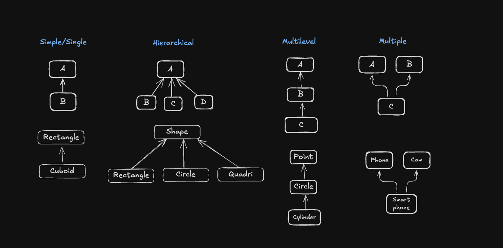

# Inheritance

## Types of Inheritance

| Access Level | Same Class | Derived Classes | Outside Classes |
|-------------|------------|-----------------|-----------------|
| `private`   | ✅ Yes     | ❌ No           | ❌ No           |
| `protected` | ✅ Yes     | ✅ Yes          | ❌ No           |
| `public`    | ✅ Yes     | ✅ Yes          | ✅ Yes          |