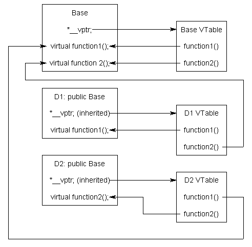

# Polymorphism

> "One interface, multiple implementationts

- The benefits of polymorphism is that let’s say you wanted to write a function that printed an animal’s name and sound. Without using a pointer to a base class, you’d have to write it using overloaded functions, like this:

```C++
void report(const Cat& cat)
{
    std::cout << cat.getName() << " says " << cat.speak() << '\n';
}

void report(const Dog& dog)
{
    std::cout << dog.getName() << " says " << dog.speak() << '\n';
}
```

- What would happen if we had 30 different animal types instead of 2. You’d have to write 30 almost identical functions.
- If you ever added a new type of animal, you’d have to write a new function for that one too.

> Virtual function resolution only works when a member function is called through a pointer or reference to a class type object.

> Never call virtual functions from constructors or destructors.

> To make virtual functions work, the compiler has to allocate an extra pointer for each object of a class that has virtual functions

## Virtual Table

- Virtual Table is a lookup table of functions used to resolve function calls in a dynamic/late binding manner.
- Vtable is simply a static array that the compiler sets up at compile time
- he compiler also adds a hidden pointer that is a member of the base class, which we will call *__vptr. *__vptr is set (automatically) when a class object is created so that it points to the virtual table for that class.

```C++
class Base
{
public:
    virtual void function1() {};
    virtual void function2() {};
};

class D1: public Base
{
public:
    void function1() override {};
};

class D2: public Base
{
public:
    void function2() override {};
};
```

- Because there are 3 classes here, the compiler will set up 3 virtual tables: one for Base, one for D1, and one for D2.
- The compiler also adds a hidden pointer member to the most base class that uses virtual functions. Although the compiler does this automatically, we’ll put it in the next example just to show where it’s added:

```C++
class Base
{
public:
    VirtualTable* __vptr;
    virtual void function1() {};
    virtual void function2() {};
};

class D1: public Base
{
public:
    void function1() override {};
};

class D2: public Base
{
public:
    void function2() override {};
};

```



## Pure Virtual (Abstract)

- It has no body at all.